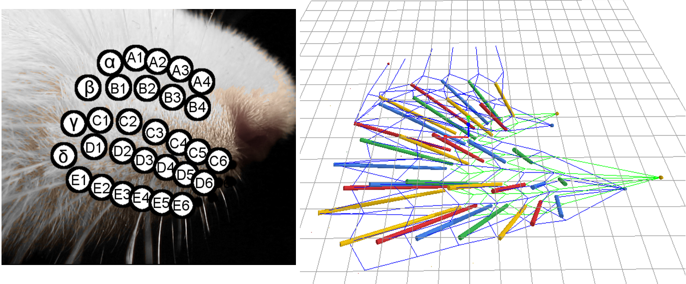

# Muscle Model

The MuscleModel, developed by the SeNSE (Hartmann) Lab at Northwestern University, is a 3D dynamical model of the one-sided rat mystacial musculature and collagenous skeleton (Haidarliu et al. 2010, Hardarliu et al. 2011) using the open-source physics engine Bullet Physics (https://github.com/bulletphysics) and OpenGL. This project is still under development but will eventually allow researchers to freely set paramteres for a certain groups of extrinsic and intrinsic muscles, as well as their actuation profile. The connection from each muscle bundle connecting follicles and facial tissues is modeled as a series of customized damped springs. A detailed description of the model is currently in preparation. 

Combined with WhiskitPhysics (https://github.com/SeNSE-lab/whiskitphysics) developed by the same lab, the researchers will also be able to simulate the movement of the whiskers by inputting different muscle parameters.



For more information or feedback contact yifuluo@u.northwestern.edu

# Demo

One side of rat facial muscles contract and retract rhythmically under proper biomechanical constraint.

Gray cylinders represent follicles for each whisker under the skin. Lines represent facial collagenous network and muscle attachments.

https://user-images.githubusercontent.com/38062004/186511644-aa9d36b3-dd33-41c1-a901-e550ea49ac9f.mp4


## Build using CMake (Windows OS):
1. Install CMake-gui [here](https://cmake.org/download/).

2. Clone this repository:

```
	git clone https://github.com/SeNSE-lab/MuscleModel.git
```

3. Clone Bullet3 (an open-source physics engine) into this repo directory

```
	git clone https://github.com/bulletphysics/bullet3
```

4. Compile Bullet first.

   Run CMake-gui.exe. 

   Select source code directory as "{your_path}/MuscleModel/bullet3".

   Select binaries directory as "{your_path}/MuscleModel/bullet3/build".
   
   **Specify "LIBRARY_OUTPUT_PATH" field value to "{your_path}/MuscleModel/bullet3/build/lib" if it is not so already.**

   Click **Configure** (select "yes" when prompted asking to create build directory), then **Generate**, select your version of visual studio as the generator.

   Double-click open "MuscleModel/bullet3-master/build/BULLET_PHYSICS.sln" using Microsoft Visual Studio.

   In the Solution Explorere, right click "ALL_BUILD" to compile Bullet physics. This may take a while.

   When finished, "File->Close solution", then exit Visual Studio.

5. Compile MuscleModel

   Run CMake-gui.exe again.

   Select source code directory as "{your_path}/MuscleModel".

   Select binaries directory as "{your_path}/MuscleModel/build".

   Click **Configure** (select "yes" when prompted asking to create build directory), then **Generate**, select your version of visual studio as the generator.

   Double-click open "MuscleModel/build/Apps_MuscleModel.sln" using Microsoft Visual Studio.

   In the Solution Explorere, right click "ALL_BUILD" to compile MuscleModel.
   
   Set 'MuscleModel' as your startup project.

   
